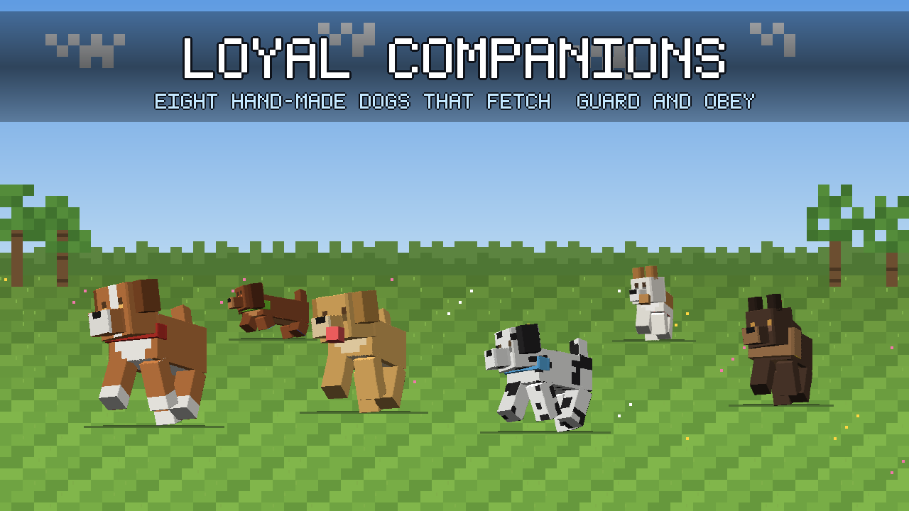

# Loyal Companions

Minecraft **Bedrock** add-on: eight hand-made dogs to tame, train and take with
you. Sibling project to [Purrfect Companions](https://purrfect.pelleops.se) —
same machinery, other animal.

[CurseForge](https://www.curseforge.com/minecraft-bedrock/addons/loyal-companions-dogs) · **[loyal.pelleops.se](https://loyal.pelleops.se)** — download and screenshots.

## The dogs

Eight dogs you can tell apart in half a second, because they differ in **size,
colour and silhouette at the same time**. The body is computed from
measurements — leg height, body length, head size, ear shape — so a dachshund
really is low and long and a Saint Bernard really is heavy. Four coloured
copies of one model looked identical from across a field; that is what this
replaced.

| Entity | Name | Breed | Build | Scale | Lives in |
|---|---|---|---|---|---|
| `hund:truffle` | Truffle | Pomeranian | ruff and a bushy tail | 0.68 | plains |
| `hund:rufus` | Rufus | Golden Retriever | hanging ears, cream chest | 1.05 | forest |
| `hund:kelda` | Kelda | Siberian Husky | dark mask, blue eyes, white socks | 1.00 | taiga |
| `hund:pepper` | Pepper | Border Collie | black with a white blaze | 0.95 | plains |
| `hund:pickle` | Pickle | Dachshund | short legs, long body, long ears | 0.80 | plains |
| `hund:bruno` | Bruno | Saint Bernard | tall, broad, heavy head | 1.20 | extreme hills |
| `hund:dot` | Dot | Dalmatian | white with spots | 1.00 | plains |
| `hund:scout` | Scout | Jack Russell Terrier | small, tan saddle | 0.75 | plains |

Tame them with **bones** — a third of the time per bone, so it costs a few.

## What they do

**Fetch.** Throw the Fetch Ball (wool ring + slime ball) — or just a stick or a
bone — and the dog runs after it, picks it up and brings it back to your hand.
It carries what it fetched visibly in its mouth.

**Take commands.** Right-click your dog with a bone to cycle **Follow → Stay →
Guard**. Guard dogs attack monsters that come near you, growl a warning when
something is close, and stay within a longer leash.

**Come when called.** The Dog Whistle (iron ingot + bone) calls every dog of
yours within 96 blocks and puts them back into Follow. It is the way out of a
Stay command you forgot about three valleys ago.

**Wear a collar.** Right-click with any of eight dyes to put a collar on your
dog, so you can tell your two border collies apart.

**Dig things up.** Every few minutes, when you are watching, a dog digs up
something — usually a bone or a bit of string, occasionally a nugget, rarely an
emerald.

**Eat, heal, breed.** Any meat heals them. Two tame, healthy dogs of the same
breed fed steak produce a puppy, and the puppy is born already yours.

**Sound like dogs.** Pitch follows size: the Pomeranian yaps and the Saint
Bernard rumbles.

### Traps already paid for

- **`minecraft:behavior.pickup_items` alone does nothing.** A dog with the
  behaviour — in a component group, in the base components, tamed, untamed,
  with and without `minecraft:equippable` — never walked to the ball. A fox in
  the same test world took the same ball every time. The difference is
  **`minecraft:shareables`**, the mob's wishlist: without it there is no item
  worth walking to. Eight server runs.
- **Vanilla destroys what the mob picks up.** There is nowhere to put it:
  `minecraft:equippable` does not even register on this entity, and a mounted
  `minecraft:inventory` stayed empty. The script therefore owns the carry — it
  removes the ball just before vanilla gets there and sets `hund:bar`. It
  cannot always win that race, so an item that vanishes while the dog is
  standing on it counts as fetched too.
- **A dog summoned at y=20 in the test world dies within a second.** The
  failure reads as "taming does not work" (0/3) when the animal is simply gone.
  The test carves a floor and an air pocket — and the pocket must be big enough
  for whatever the test does inside it: a fetch test that drops the ball eight
  blocks away needs eight blocks of floor.
- **Hard-coded lists go stale.** The breed list is read from the pack, never
  written twice. `APPORTBARA` exists in both the generator and the script
  because the script cannot read entity JSON — so the test compares them.
- **Invisible ears.** One unit thick in the coat colour: the golden retriever
  looked like a wolf. Nothing in any log says so. `tools/render_dogs.py` exists
  because the only other way to find that out is to ship it.
- **A text replacement takes the first match.** The digging code was inserted
  into the whistle function instead of the main loop; the reference error
  vanished into a `catch` and the symptom was "the whistle does not bring the
  dog home".
- **`"mountain"` and `"forest"` are both real biome tags, `"mountains"` is
  not.** A wrong tag means a breed that simply never appears, silently. The
  test checks them against vanilla's biome definitions — not against vanilla's
  spawn rules, which use only a handful of them.
- **Two goals with the same priority is undefined.** `stay_while_sitting` and
  `melee_attack` both sat on 5; a sitting guard dog was a lottery. The clash
  only exists in the *combination* of component groups that can be active
  together, so the test checks the combinations, not the groups.
- **`minecraft:persistent` on a wild animal never despawns.** Eight breeds
  that stay forever swell a world year after year. It belongs in the tamed
  group, not in the base components.
- **A command has to survive temptation.** Fetch switched on regardless of
  mode, and `pickup_items` moves the dog — so "stay" lasted until someone
  dropped a stick within sixteen blocks. The test now proves a staying dog
  ignores a ball eight blocks away, and that test was verified by putting the
  bug back and watching it fail.
- **A here-document terminator must stand alone on its line**: `PY)` is not a
  terminator, and bash silently swallows the rest of the file.
